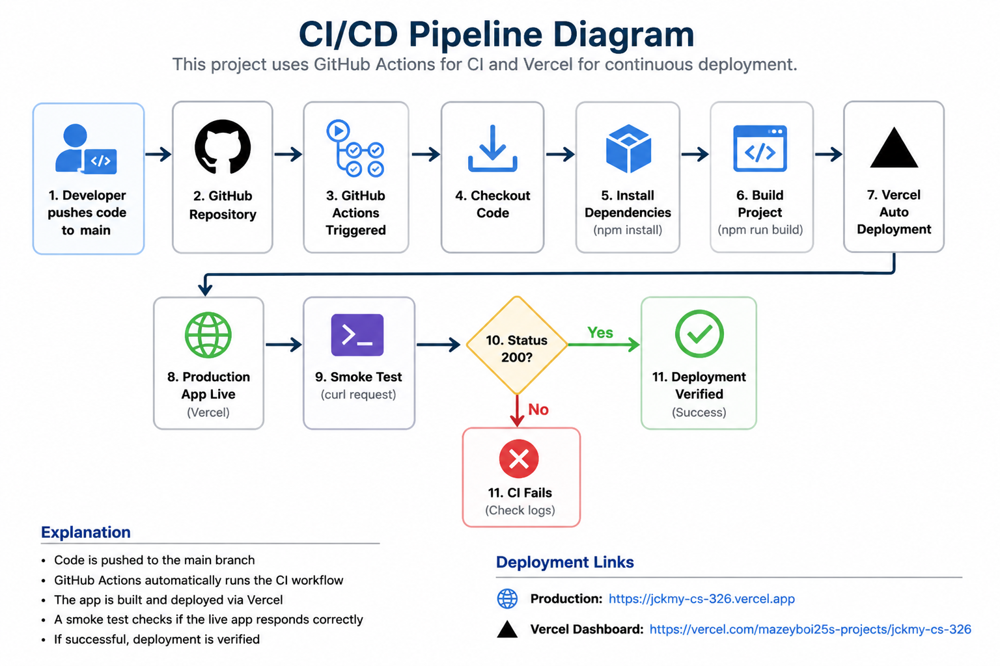

# CI/CD Pipeline Diagram

This project uses GitHub Actions for CI and Vercel for continuous deployment.

## Pipeline Overview

```mermaid
graph TD
    A[Developer pushes code to main] --> B[GitHub Repository]

    B --> C[GitHub Actions Triggered]

    C --> D[Checkout Code]
    D --> E[Install Dependencies]
    E --> F[Build Project]

    F --> G[Vercel Auto Deployment]

    G --> H[Production App Live]

    H --> I[Smoke Test (curl request)]
    I --> J{Status 200?}

    J -->|Yes| K[Deployment Verified]
    J -->|No| L[CI Fails]
```

## Explanation

- Code is pushed to the `main` branch
- GitHub Actions automatically runs the CI workflow
- The app is built and deployed via Vercel
- A smoke test checks if the live app responds correctly
- If successful, deployment is verified

## Deployment Links

- Production: https://jckmy-cs-326.vercel.app  
- Vercel Dashboard: https://vercel.com/mazeyboi25s-projects/jckmy-cs-326

