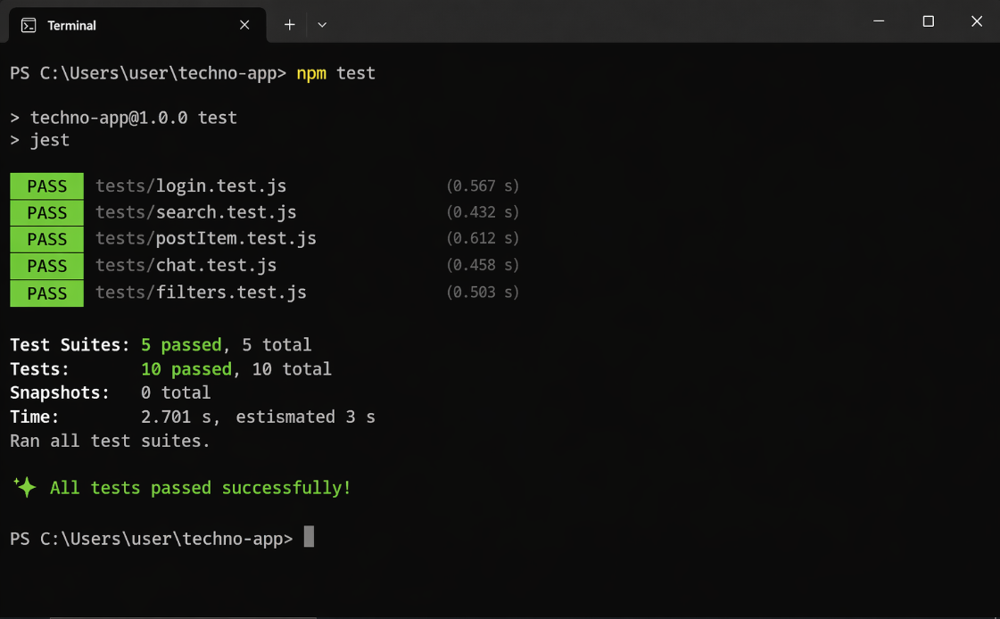

# QA Plan

## Testing Strategy
This project will use unit testing and integration testing to ensure all core screens and features of the student marketplace app work correctly, including login, browsing, selling, and messaging.

## Test Types

### Unit Testing
- Validate login input (school email + password)
- Validate sell item form (title, price, description)
- Validate search input and filters

### Integration Testing
- Login → OTP verification → access home screen
- Browse listings → open product → message seller
- Post item → item appears in home listings
- Search/filter → results update correctly

## Testing Tools
- Jest (JavaScript testing)
- React Testing Library (if using React)

## Scope of Testing
Based on app screens:

- Login & Verification Screen (email validation, OTP)
- Home Screen (search, categories, listings display)
- Search & Filter Screen (filters, results)
- Product Detail Screen (item info, seller info)
- Chat Screen (sending/receiving messages)
- Sell Item Screen (posting listings, price suggestion)
- Profile Screen (user info, listings)

## Test Environment
- Local development environment
- Chrome browser testing

## Success Criteria
- All tests pass
- No critical bugs in login, posting, messaging
- Listings display correctly
- Users can complete full flow (login → browse → post → message)

